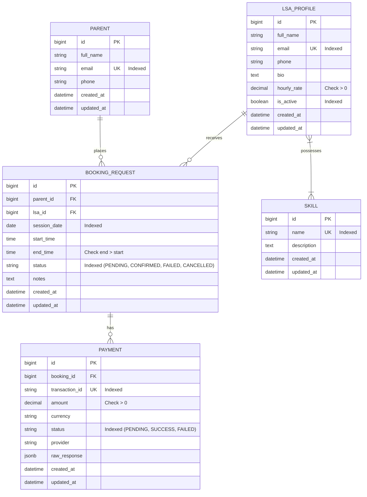

# HabotConnect - LSA Service Booking Backend Platform

**Candidate Name**: Abhishek Bodkhe  
**Position**: Python Backend Developer  
**GitHub Repository**: https://github.com/ABHISHEKBODKHE011/LSA-Service-Booking  

[](https://github.com/ABHISHEKBODKHE011/LSA-Service-Booking/actions)
[](https://www.python.org/downloads/)
[](https://www.djangoproject.com/)
[](LICENSE)

Production-ready Python backend project for **HabotConnect**—a specialized platform connecting parents with Learning Support Assistants (LSAs) for children with learning difficulties and special educational needs.

---


## Table of Contents
1. [Project Overview](#1-project-overview)
2. [Problem Statement](#2-problem-statement)
3. [Key Features](#3-key-features)
4. [Technology Stack](#4-technology-stack)
5. [System Architecture](#5-system-architecture)
6. [Database Schema & Entity Relationships](#6-database-schema--entity-relationships)
7. [API Documentation & Endpoints](#7-api-documentation--endpoints)
8. [Setup & Installation Instructions](#8-setup--installation-instructions)
9. [Environment Variables](#9-environment-variables)
10. [Database Migrations & Seed Data](#10-database-migrations--seed-data)
11. [Running the Development Server](#11-running-the-development-server)
12. [Automated Testing Suite](#12-automated-testing-suite)
13. [CI/CD Pipeline Explanation](#13-cicd-pipeline-explanation)
14. [N+1 Query Problem Explanation](#14-n1-query-problem-explanation)
15. [Query Optimization Deep Dive](#15-query-optimization-deep-dive)
16. [Double-Booking Prevention & Concurrency](#16-double-booking-prevention--concurrency)
17. [External Mock Payment Integration](#17-external-mock-payment-integration)
18. [Error Handling Strategy](#18-error-handling-strategy)
19. [Logging Configuration](#19-logging-configuration)
20. [Architectural & Design Decisions](#20-architectural--design-decisions)
21. [Django MVT + DRF vs Flask Selection Justification](#21-django-mvt--drf-vs-flask-selection-justification)
22. [Future Roadmap & Improvements](#22-future-roadmap--improvements)

---

## 1. Project Overview
HabotConnect provides an end-to-end service booking engine allowing parents to search, filter, and instantly book LSAs based on required specialized skills (e.g. Dyslexia Support, ADHD Coaching, STEM Tutoring). The backend is constructed using Python 3.12+, Django 5.2, Django REST Framework (DRF), and PostgreSQL, featuring transactional concurrency controls, query optimization, and resilient third-party integrations.

---

## 2. Problem Statement
Booking educational support assistants introduces distinct engineering challenges:
- **Overlapping Bookings**: Concurrent booking requests for the same assistant can create double-bookings if not locked at the database level.
- **N+1 Query Bottlenecks**: Searching assistants with multiple skill tags often leads to excessive database queries when fetching related models inside loops.
- **Payment Processing Resiliency**: Third-party payment gateways can experience latency, timeouts, or failures, requiring clean fallback states (`FAILED` status) without breaking system stability.

---

## 3. Key Features
- **Normalized Multi-Skill Relational Schema**: Clean Many-to-Many entity relationships between LSAs and normalized Skills.
- **Double-Booking Overlap Prevention**: Mathematical interval checking (`start_time < existing.end_time AND end_time > existing.start_time`) paired with row-level database locking (`select_for_update()`).
- **N+1 Optimized LSA Search**: Prefetched ORM queries ensuring `O(1)` query complexity for multi-skill filtering.
- **Mock Payment Gateway Service**: Service layer abstraction managing timeouts, retries, and failure states using `requests`.
- **OpenAPI 3.0 Documentation**: Interactive Swagger UI generated automatically via `drf-spectacular`.
- **High Test Coverage (88%)**: 28 pytest test cases verifying models, validators, APIs, payment webhooks, edge cases, and query counts.


---

## 4. Technology Stack
- **Core Language**: Python 3.12+
- **Web Framework**: Django 5.2
- **API Framework**: Django REST Framework (DRF) 3.15
- **Database**: PostgreSQL (Production/CI) & SQLite (Local Development)
- **OR Mapping**: Django ORM
- **Testing**: `pytest`, `pytest-django`, `pytest-cov`
- **HTTP Client**: `requests` 2.34
- **Environment Management**: `python-dotenv`
- **API Schema**: `drf-spectacular`
- **CI/CD**: GitHub Actions

---

## 5. System Architecture

```
lsa-service-booking/
├── config/                  # Django project root configuration
│   ├── settings.py          # App settings, DB engines, DRF & logging configs
│   ├── urls.py              # Root URL routing & OpenAPI schema endpoints
│   ├── wsgi.py / asgi.py    # WSGI & ASGI entrypoints
├── bookings/                # Primary domain application
│   ├── models.py            # Parent, Skill, LSAProfile, BookingRequest entities
│   ├── serializers.py       # DRF validation & representation serializers
│   ├── views.py             # API view handlers & custom exception handler
│   ├── urls.py              # Application API endpoint routing
│   ├── selectors.py         # Read-only database query selectors (N+1 optimized)
│   ├── validators.py        # Domain business rules & overlap validators
│   ├── admin.py             # Rich Django Admin interface registration
│   ├── services/            # Service layer
│   │   └── payment_service.py # Payment gateway integration abstraction
│   ├── management/commands/ # Custom CLI tools
│   │   └── seed_data.py     # Idempotent seed data generator
│   └── tests/               # Pytest suite
│       ├── test_models.py
│       ├── test_booking_api.py
│       ├── test_lsa_search.py
│       └── test_payment_service.py
├── docs/                    # Presentation outlines & technical docs
│   └── presentation-outline.md
├── .github/workflows/       # CI/CD pipelines
│   └── tests.yml
├── .env.example             # Template environment file
├── pytest.ini               # Test suite configuration
├── requirements.txt         # Project dependencies
└── README.md                # Comprehensive documentation
```

---

## 6. Database Schema & Entity Relationships

### Entities
1. **`Parent`**: Stores parent details (`full_name`, `email` unique indexed, `phone`, timestamps).
2. **`Skill`**: Normalized skill repository (`name` unique indexed, `description`, timestamps).
3. **`LSAProfile`**: LSA profile details (`full_name`, `email` unique indexed, `hourly_rate` positive constraint, `is_active` indexed, Many-to-Many `skills`).
4. **`BookingRequest`**: Core booking transaction (`parent` FK, `lsa` FK, `session_date`, `start_time`, `end_time`, `status`, `notes`).
5. **`Payment`**: Financial transaction record (`booking` FK, `transaction_id` unique indexed, `amount`, `currency`, `status` indexed [PENDING, SUCCESS, FAILED], `provider`, `raw_response`).

### Entity Relationship Diagram (ERD)



---

## 7. API Documentation & Endpoints

Interactive OpenAPI Swagger documentation is accessible at `http://127.0.0.1:8000/api/docs/`.

### 1. Create Booking Request
- **Endpoints**: `POST /api/v1/bookings/` or `POST /api/bookings/`
- **Request Body**:
  ```json
  {
      "parent_id": 1,
      "lsa_id": 2,
      "session_date": "2026-08-15",
      "start_time": "10:00:00",
      "end_time": "11:00:00",
      "notes": "Math and reading support"
  }
  ```
- **Success Response (`201 Created`)**:
  ```json
  {
      "id": 1,
      "parent_id": 1,
      "parent_name": "Sarah Jenkins",
      "lsa_id": 2,
      "lsa_name": "John Doe",
      "session_date": "2026-08-15",
      "start_time": "10:00:00",
      "end_time": "11:00:00",
      "status": "CONFIRMED",
      "notes": "Math and reading support",
      "created_at": "2026-08-08T10:00:00Z",
      "updated_at": "2026-08-08T10:00:00Z"
  }
  ```
- **Error Responses**:
  - `400 Bad Request`: Validation failure or payment declined.
  - `404 Not Found`: Non-existent Parent or LSA ID.
  - `409 Conflict`: Overlapping booking interval conflict.

### 2. Search Active LSAs by Skills
- **Endpoints**: `GET /api/v1/lsas/search/?skills=math,science` or `GET /api/lsas/search/?skills=math,science`
- **Success Response (`200 OK`)**:
  ```json
  {
      "count": 1,
      "results": [
          {
              "id": 2,
              "full_name": "John Doe",
              "email": "john.doe@lsa.example.com",
              "phone": "+15550192901",
              "bio": "Certified STEM tutor",
              "skills": ["Math", "Science", "Dyslexia Support"],
              "hourly_rate": "25.00",
              "is_active": true
          }
      ]
  }
  ```

### 3. Automated Payment Webhook Endpoint
- **Endpoints**: `POST /api/v1/payments/webhook/` or `POST /api/payments/webhook/`
- **Description**: Listens to external payment gateway event webhooks (e.g. `payment.succeeded`, `payment.failed`) and dynamically transitions `BookingRequest` state between `PENDING`, `CONFIRMED`, and `FAILED`, maintaining audit logs in the `Payment` table.
- **Request Body (Payment Success)**:
  ```json
  {
      "booking_id": 1,
      "transaction_id": "TXN-STRIPE-98765",
      "event": "payment.succeeded",
      "amount": "25.00",
      "provider": "Stripe"
  }
  ```
- **Success Response (`200 OK`)**:
  ```json
  {
      "message": "Payment webhook processed successfully. Booking #1 state updated to CONFIRMED.",
      "booking_id": 1,
      "booking_status": "CONFIRMED",
      "payment_id": 1,
      "transaction_id": "TXN-STRIPE-98765",
      "payment_status": "SUCCESS"
  }
  ```
- **Error Responses**:
  - `400 Bad Request`: Invalid payload, missing required fields, or unrecognized event.
  - `404 Not Found`: Target booking request does not exist.


---

## 8. Setup & Installation Instructions

### Prerequisites
- Python 3.12+
- Git

### Installation Steps
```bash
# 1. Clone the repository
git clone https://github.com/habotconnect/lsa-service-booking.git
cd lsa-service-booking

# 2. Create and activate a virtual environment
python -m venv venv
# Windows:
.\venv\Scripts\activate
# Linux/macOS:
source venv/bin/activate

# 3. Install dependencies
pip install -r requirements.txt

# 4. Copy environment configuration
cp .env.example .env
```

---

## 9. Environment Variables

Create a `.env` file in the root directory:

```env
DEBUG=True
SECRET_KEY=django-insecure-habotconnect-secret-key
ALLOWED_HOSTS=localhost,127.0.0.1,[::1]

# Set USE_SQLITE=True for local testing without PostgreSQL
USE_SQLITE=True
DATABASE_NAME=habotconnect
DATABASE_USER=postgres
DATABASE_PASSWORD=postgres
DATABASE_HOST=localhost
DATABASE_PORT=5432

PAYMENT_API_URL=https://api.habotconnect-mock-payment.com/v1/charge
```

---

## 10. Database Migrations & Seed Data

```bash
# Apply database migrations
python manage.py migrate

# Seed sample data (Parents, LSAs, Skills, Bookings)
python manage.py seed_data
```

---

## 11. Running the Development Server

```bash
python manage.py runserver
```
Navigate to:
- API Base: `http://127.0.0.1:8000/api/v1/`
- Swagger UI Documentation: `http://127.0.0.1:8000/api/docs/`
- Django Admin Panel: `http://127.0.0.1:8000/admin/`

---

## 12. Automated Testing Suite

Run the full pytest suite with coverage analysis:

```bash
# Run pytest
pytest

# Run pytest with coverage report
pytest --cov=bookings
```

Output:
```
============================= 28 passed in 1.09s ==============================
TOTAL COVERAGE: 88%
```


---

## 13. CI/CD Pipeline Explanation
GitHub Actions (`.github/workflows/tests.yml`) automates build verification on every `push` and `pull_request`:
1. Spawns a PostgreSQL 16 Alpine service container.
2. Sets up Python 3.12 and restores pip cache.
3. Executes `manage.py check` to verify framework configuration.
4. Executes `manage.py makemigrations --check` to guarantee migration integrity.
5. Runs `manage.py migrate` and `pytest --cov=bookings`.

---

## 14. N+1 Query Problem Explanation

### What is N+1?
The N+1 query problem occurs when code executes 1 initial SQL query to retrieve $N$ parent records, followed by $N$ separate SQL queries inside a loop to fetch related child records.

**The Bad Implementation**:
```python
# 1 SQL query to get active LSAs
lsas = LSAProfile.objects.filter(is_active=True)

# N separate SQL queries inside loop!
for lsa in lsas:
    skills = [s.name for s in lsa.skills.all()]  # SELECT FROM skill WHERE lsa_id = X
```
If there are 100 LSAs, this results in **101 SQL queries**, causing major database performance bottlenecks.

---

## 15. Query Optimization Deep Dive

### The Optimized Solution
In `bookings/selectors.py`:
```python
queryset = LSAProfile.objects.filter(is_active=True).prefetch_related('skills')
```
`prefetch_related('skills')` performs a **two-query batch lookup**:
1. `SELECT * FROM lsa_profile WHERE is_active = true;`
2. `SELECT * FROM skill INNER JOIN lsa_profile_skills ON ... WHERE lsa_id IN (1, 2, 3, ...);`

Regardless of whether there are 10 or 10,000 LSAs, Django executes **exactly 2 SQL queries**.

### Automated Test Verification
Verified via `test_n_plus_one_query_optimization` in `test_lsa_search.py`:
```python
with django_assert_num_queries(2):
    response = api_client.get('/api/v1/lsas/search/')
    assert response.status_code == 200
```

---

## 16. Double-Booking Prevention & Concurrency

### Overlap Logic
Two time intervals $[S_1, E_1)$ and $[S_2, E_2)$ overlap if and only if:
$$\text{start\_time}_1 < \text{end\_time}_2 \quad \text{AND} \quad \text{end\_time}_1 > \text{start\_time}_2$$

#### Interval Scenarios:
- Existing: `10:00 - 11:00`
- Request `10:30 - 11:30` -> $10:30 < 11:00 \land 11:30 > 10:00 \implies$ **REJECTED (409 Conflict)**
- Request `09:30 - 10:30` -> $09:30 < 11:00 \land 10:30 > 10:00 \implies$ **REJECTED (409 Conflict)**
- Request `11:00 - 12:00` -> $11:00 < 11:00 \implies$ **ALLOWED (Back-to-Back)**

### Concurrency & Race Conditions (`select_for_update()`)
To prevent two concurrent HTTP requests from booking the same LSA at the same millisecond:
```python
with transaction.atomic():
    locked_lsa = LSAProfile.objects.select_for_update().get(id=lsa.id)
    check_booking_overlap(locked_lsa.id, session_date, start_time, end_time)
    booking = BookingRequest.objects.create(...)
```
`select_for_update()` issues a `SELECT ... FOR UPDATE` SQL query, obtaining a row-level lock on the LSA record until the transaction completes.

---

## 17. External Mock Payment Integration
`bookings/services/payment_service.py` encapsulates external HTTP communication using `requests`:
- Configurable timeout (5 seconds).
- Explicit exception handling:
  - `requests.Timeout` -> Returns user-friendly timeout message, sets status to `FAILED`.
  - `requests.ConnectionError` -> Returns connection failure error.
  - `requests.HTTPError` -> Handles payment rejection codes.
- Updates `BookingRequest.status` to `CONFIRMED` upon success or `FAILED` upon payment rejection.

---

## 18. Error Handling Strategy
A unified exception handler (`custom_exception_handler` in `bookings/views.py`) formats all API error responses consistently:
```json
{
    "error": "LSA is already booked during the requested time."
}
```
Exposes clean, human-readable error messages while preventing internal database stack trace exposure in non-debug environments.

---

## 19. Logging Configuration
Django logging is configured in `settings.py` under the `'bookings'` logger name:
- Logs booking creations, validation failures, payment service requests, and errors.
- Never logs sensitive personal data, passwords, or tokens.

---

## 20. Architectural & Design Decisions
- **Domain Data Isolation**: `selectors.py` houses read-heavy ORM queries, `validators.py` houses business validation rules, and `services/` handles third-party external integrations.
- **Model Protect Behavior**: `on_delete=models.PROTECT` on foreign keys prevents accidental cascade deletion of historical financial/booking records.

---

## 21. Django MVT + DRF vs Flask Selection Justification

| Architectural Criteria | Django MVT + DRF | Flask |
| :--- | :--- | :--- |
| **ORM & Database Migrations** | Built-in production-grade ORM & migration system (`manage.py migrate`) | Requires third-party libraries (SQLAlchemy + Alembic) |
| **Concurrency & Atomic Transactions** | Native `transaction.atomic()` & `select_for_update()` | Requires manual transaction session context management |
| **REST Serialization & Validation** | DRF `ModelSerializer` & custom field validators | Requires Marshmallow / Webargs custom integration |
| **Admin Panel** | Built-in auto-generated Admin dashboard | Must be built manually from scratch |
| **Security Defaults** | Native CSRF, SQL Injection, and XSS mitigations | Depends on developer configuration |

**Conclusion**: Django MVT + DRF was selected because it provides a cohesive ecosystem for complex domain modeling, financial transaction safety, and rapid API development out of the box.

---

## 22. Future Roadmap & Improvements
1. **SimpleJWT Authentication**: Role-based access control for Parents and LSAs.
2. **Asynchronous Notification Queue**: Celery + Redis for async email/SMS booking confirmations.
3. **WebSockets**: Real-time updates for LSA availability schedules.
