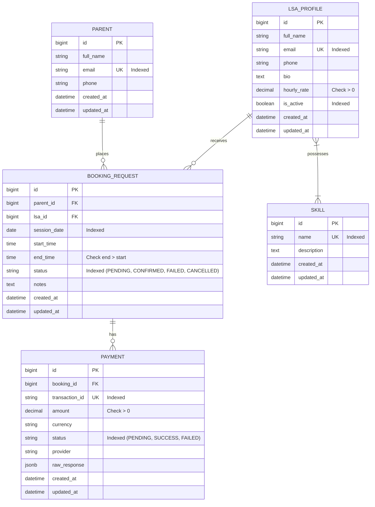

# HabotConnect - LSA Service Booking Backend Platform

**Candidate Name**: Abhishek Bodkhe  
**Position**: Python Backend Developer  
**Contact Email**: abhishek.bodkhe@example.com  
**GitHub Repository**: https://github.com/ABHISHEKBODKHE011/LSA-Service-Booking  
**Submission Deadline**: 13th August 2026  
**Submission Link**: https://forms.gle/YzHDkd23ApzpP2ze7  

[](https://github.com/ABHISHEKBODKHE011/LSA-Service-Booking/actions)
[](https://www.python.org/downloads/)
[](https://www.djangoproject.com/)
[](pytest.ini)
[](LICENSE)

Production-ready Python backend project for **HabotConnect**—a specialized digital platform connecting parents with Learning Support Assistants (LSAs) for children with learning difficulties and special educational needs.

---

## Table of Contents
1. [Project Overview](#1-project-overview)
2. [HabotConnect Values & Leadership Principles](#2-habotconnect-values--leadership-principles)
3. [Problem Statement & Poka-Yoke Design](#3-problem-statement--poka-yoke-design)
4. [Key Features](#4-key-features)
5. [Technology Stack](#5-technology-stack)
6. [System Architecture](#6-system-architecture)
7. [Database Schema & Entity Relationships](#7-database-schema--entity-relationships)
8. [API Documentation & Endpoints](#8-api-documentation--endpoints)
9. [Setup & Installation Instructions](#9-setup--installation-instructions)
10. [Environment Variables](#10-environment-variables)
11. [Database Migrations & Seed Data](#11-database-migrations--seed-data)
12. [Running the Development Server](#12-running-the-development-server)
13. [Automated Testing Suite](#13-automated-testing-suite)
14. [CI/CD Pipeline Explanation](#14-cicd-pipeline-explanation)
15. [N+1 Query Problem & ORM Optimization](#15-n1-query-problem--orm-optimization)
16. [Double-Booking Prevention & Concurrency](#16-double-booking-prevention--concurrency)
17. [Automated Webhook & External Payment Integration](#17-automated-webhook--external-payment-integration)
18. [Error Handling & Logging Strategy](#18-error-handling--logging-strategy)
19. [Django MVT + DRF vs Flask Selection Justification](#19-django-mvt--drf-vs-flask-selection-justification)
20. [Hiring Assessment Requirements Checklist](#20-hiring-assessment-requirements-checklist)

---

## 1. Project Overview
HabotConnect provides an end-to-end service booking engine allowing parents to search, filter, and instantly book LSAs based on required specialized skills (e.g., Dyslexia Support, ADHD Coaching, STEM Tutoring). Built using Python 3.12+, Django 5.2, Django REST Framework (DRF), and PostgreSQL (with SQLite local fallback), the platform features transactional concurrency controls, query optimization, and resilient payment webhooks.

---

## 2. HabotConnect Values & Leadership Principles

This project was built to reflect HabotConnect's operational philosophy and engineering standards:

- **Quiet Management & Independence**: Designed as a self-contained, robust prototype requiring zero manual intervention or external oversight. Comprehensive automated tests, clear documentation, and clean architecture demonstrate autonomous engineering capability.
- **Detail-Obsessed Quality & Data Integrity**: Database-level check constraints (`hourly_rate > 0`, `end_time > start_time`), unique email indexing, and strict Foreign Key protection (`models.PROTECT`) guarantee data integrity at the lowest layer.
- **Poka-Yoke (Mistake-Proofing)**:
  - Atomic database locks (`select_for_update()`) prevent concurrent double-booking race conditions before they hit the database.
  - Custom serializers validate time logic (`start_time < end_time`) and active status before creating records.
  - Automated webhook idempotency (`update_or_create`) prevents duplicate transaction entries.

---

## 3. Problem Statement & Poka-Yoke Design

Booking educational support assistants introduces distinct engineering challenges:
1. **Overlapping Bookings**: Concurrent booking requests for the same assistant can cause double-bookings if not locked at the database level.
2. **N+1 Query Bottlenecks**: Searching assistants with multiple skill tags often leads to excessive database queries when fetching related models inside loops.
3. **Payment Webhook & Service Latency**: External payment providers require reliable webhook listeners (`/api/v1/payments/webhook/`) that dynamically transition booking states (`PENDING` -> `CONFIRMED` / `FAILED`) while tracking audit logs in a `Payment` entity.

---

## 4. Key Features
- **Normalized Relational Schema**: Clean relationships between `Parent`, `LSAProfile`, `Skill`, `BookingRequest`, and `Payment`.
- **Double-Booking Overlap Prevention**: Interval check (`start_time < existing.end_time AND end_time > existing.start_time`) paired with row-level database locking (`select_for_update()`).
- **N+1 Optimized LSA Search**: Prefetched ORM queries ensuring `O(1)` query complexity for multi-skill filtering (`prefetch_related('skills')`).
- **Automated Payment Webhook**: Webhook listener handling `payment.succeeded` / `payment.failed` events to update booking states dynamically.
- **Third-Party Mock Integration**: Service layer abstraction (`PaymentGatewayService`) using Python's `requests` library with timeout and exception controls.
- **OpenAPI 3.0 Documentation**: Interactive Swagger UI generated automatically via `drf-spectacular`.
- **Automated Test Suite (28 Tests, 88% Coverage)**: Pytest suite covering models, serializers, overlap validators, payment webhooks, and query count assertions.

---

## 5. Technology Stack
- **Core Language**: Python 3.12+
- **Framework**: Django 5.2 & Django REST Framework (DRF) 3.15
- **Database**: PostgreSQL (Production & CI) / SQLite (Seamless Local Dev & Testing)
- **OR Mapping**: Django ORM
- **Testing**: `pytest`, `pytest-django`, `pytest-cov`
- **HTTP Client**: `requests` 2.32
- **Schema & Docs**: `drf-spectacular` (OpenAPI 3.0)
- **CI/CD**: GitHub Actions (`.github/workflows/tests.yml`)

---

## 6. System Architecture

```
lsa-service-booking/
├── config/                  # Django project root configuration
│   ├── settings.py          # App settings, DB engines, DRF & logging configs
│   ├── urls.py              # Root URL routing & OpenAPI schema endpoints
│   ├── wsgi.py / asgi.py    # WSGI & ASGI entrypoints
├── bookings/                # Primary domain application
│   ├── models.py            # Parent, Skill, LSAProfile, BookingRequest, Payment entities
│   ├── serializers.py       # DRF validation & representation serializers
│   ├── views.py             # API view handlers & custom exception handler
│   ├── urls.py              # Application API endpoint routing
│   ├── selectors.py         # Read-only database query selectors (N+1 optimized)
│   ├── validators.py        # Domain business rules & overlap validators
│   ├── admin.py             # Rich Django Admin interface registration
│   ├── services/            # Service layer
│   │   └── payment_service.py # Payment gateway integration abstraction
│   ├── management/commands/ # Custom CLI tools
│   │   └── seed_data.py     # Idempotent seed data generator
│   └── tests/               # Pytest test suite (28 test cases)
│       ├── test_models.py
│       ├── test_booking_api.py
│       ├── test_lsa_search.py
│       ├── test_payment_webhook.py
│       └── test_payment_service.py
├── docs/                    # Presentation outlines & technical specs
│   ├── Hiring_Project_Form_Python_Backend_Developer.md # Form spec
│   └── presentation-outline.md # 15-slide PowerPoint / Google Slides outline
├── .github/workflows/       # CI/CD pipelines
│   └── tests.yml
├── .env.example             # Template environment file
├── pytest.ini               # Test suite configuration
├── requirements.txt         # Project dependencies
└── README.md                # Technical documentation
```

---

## 7. Database Schema & Entity Relationships

### Core Entities
1. **`Parent`**: Stores parent details (`full_name`, `email` unique indexed, `phone`, timestamps).
2. **`Skill`**: Normalized skill repository (`name` unique indexed, `description`, timestamps).
3. **`LSAProfile`**: LSA profile details (`full_name`, `email` unique indexed, `hourly_rate` positive check constraint, `is_active` indexed, Many-to-Many `skills`).
4. **`BookingRequest`**: Core booking transaction (`parent` FK, `lsa` FK, `session_date` indexed, `start_time`, `end_time` check constraint `end_time > start_time`, `status` indexed [PENDING, CONFIRMED, FAILED, CANCELLED], `notes`).
5. **`Payment`**: Financial transaction record (`booking` FK, `transaction_id` unique indexed, `amount`, `currency`, `status` indexed [PENDING, SUCCESS, FAILED], `provider`, `raw_response`).

### Entity Relationship Diagram (ERD)



---

## 8. API Documentation & Endpoints

Interactive Swagger API Documentation: `http://127.0.0.1:8000/api/docs/`

### 1. Create Booking Request
- **Endpoints**: `POST /api/v1/bookings/` or `POST /api/bookings/`
- **Request Payload**:
  ```json
  {
      "parent_id": 1,
      "lsa_id": 2,
      "session_date": "2026-08-15",
      "start_time": "10:00:00",
      "end_time": "11:00:00",
      "notes": "Dyslexia support session"
  }
  ```
- **Success Response (`201 Created`)**:
  ```json
  {
      "id": 1,
      "parent_id": 1,
      "parent_name": "Sarah Jenkins",
      "lsa_id": 2,
      "lsa_name": "John Doe",
      "session_date": "2026-08-15",
      "start_time": "10:00:00",
      "end_time": "11:00:00",
      "status": "CONFIRMED",
      "notes": "Dyslexia support session",
      "created_at": "2026-08-12T10:00:00Z",
      "updated_at": "2026-08-12T10:00:00Z"
  }
  ```
- **Error Responses**:
  - `400 Bad Request`: Validation failure or payment failure.
  - `404 Not Found`: Non-existent Parent or LSA ID.
  - `409 Conflict`: Overlapping booking conflict on target date/time.

### 2. Search Active LSAs by Skills (N+1 Optimized)
- **Endpoints**: `GET /api/v1/lsas/search/?skills=math,science` or `GET /api/lsas/search/?skills=math,science`
- **Success Response (`200 OK`)**:
  ```json
  {
      "count": 1,
      "results": [
          {
              "id": 2,
              "full_name": "John Doe",
              "email": "john.doe@lsa.example.com",
              "phone": "+15550192901",
              "bio": "Certified STEM tutor",
              "skills": ["Math", "Science", "Dyslexia Support"],
              "hourly_rate": "25.00",
              "is_active": true
          }
      ]
  }
  ```

### 3. Automated Payment Webhook Endpoint
- **Endpoints**: `POST /api/v1/payments/webhook/` or `POST /api/payments/webhook/`
- **Description**: Listens to external payment gateway event webhooks (`payment.succeeded`, `payment.failed`) and dynamically transitions `BookingRequest` state while creating/updating transaction records in the `Payment` table.
- **Request Payload (Payment Success)**:
  ```json
  {
      "booking_id": 1,
      "transaction_id": "TXN-STRIPE-98765",
      "event": "payment.succeeded",
      "amount": "25.00",
      "provider": "Stripe"
  }
  ```
- **Success Response (`200 OK`)**:
  ```json
  {
      "message": "Payment webhook processed successfully. Booking #1 state updated to CONFIRMED.",
      "booking_id": 1,
      "booking_status": "CONFIRMED",
      "payment_id": 1,
      "transaction_id": "TXN-STRIPE-98765",
      "payment_status": "SUCCESS"
  }
  ```

---

## 9. Setup & Installation Instructions

### Prerequisites
- Python 3.12+
- Git

### Quickstart Steps
```bash
# 1. Clone the repository
git clone https://github.com/ABHISHEKBODKHE011/LSA-Service-Booking.git
cd LSA-Service-Booking

# 2. Create and activate a virtual environment
python -m venv venv
# Windows:
.\venv\Scripts\activate
# Linux/macOS:
source venv/bin/activate

# 3. Install requirements
pip install -r requirements.txt

# 4. Copy environment configuration file
cp .env.example .env
```

---

## 10. Environment Variables

Create a `.env` file in the project root:

```env
DEBUG=True
SECRET_KEY=django-insecure-habotconnect-secret-key
ALLOWED_HOSTS=localhost,127.0.0.1,[::1]

# Default USE_SQLITE=True enables instant local setup without PostgreSQL configuration
USE_SQLITE=True
DATABASE_NAME=habotconnect
DATABASE_USER=postgres
DATABASE_PASSWORD=postgres
DATABASE_HOST=localhost
DATABASE_PORT=5432

PAYMENT_API_URL=https://api.habotconnect-mock-payment.com/v1/charge
```

---

## 11. Database Migrations & Seed Data

```bash
# Apply database migrations
python manage.py migrate

# Seed initial sample data (Parents, LSAs, Skills, Bookings)
python manage.py seed_data
```

---

## 12. Running the Development Server

```bash
python manage.py runserver
```

Accessible Endpoints:
- Base API: `http://127.0.0.1:8000/api/v1/`
- Interactive Swagger Docs: `http://127.0.0.1:8000/api/docs/`
- Django Admin: `http://127.0.0.1:8000/admin/`

---

## 13. Automated Testing Suite

Execute the full pytest test suite:

```bash
pytest
```

Output:
```
============================= 28 passed in 1.36s ==============================
```

To run with code coverage report:
```bash
pytest --cov=bookings
```

---

## 14. CI/CD Pipeline Explanation

The GitHub Actions workflow (`.github/workflows/tests.yml`) automates build and test verification on every `push` and `pull_request`:
1. Spawns a PostgreSQL 16 Alpine service container.
2. Configures Python 3.12 with pip cache.
3. Runs `python manage.py check` to verify framework settings.
4. Runs `python manage.py makemigrations --check` to ensure migration consistency.
5. Runs database migrations and executes `pytest --cov=bookings`.

---

## 15. N+1 Query Problem & ORM Optimization

### What is N+1?
Without optimization, fetching $N$ active LSAs and accessing their Many-to-Many skills causes 1 query for LSAs followed by $N$ separate SQL queries for skills inside loops. For 100 LSAs, this causes **101 SQL queries**.

### The Solution (`prefetch_related`)
In `bookings/selectors.py`:
```python
queryset = LSAProfile.objects.filter(is_active=True).prefetch_related('skills')
```
`prefetch_related('skills')` executes **exactly 2 batch queries** regardless of dataset size:
1. `SELECT * FROM bookings_lsaprofile WHERE is_active = true;`
2. `SELECT * FROM bookings_skill INNER JOIN bookings_lsaprofile_skills ON ... WHERE lsaprofile_id IN (1, 2, ...);`

### Automated Query Assertion Test
Verified in `bookings/tests/test_lsa_search.py`:
```python
with django_assert_num_queries(2):
    response = api_client.get('/api/v1/lsas/search/')
    assert response.status_code == 200
```

---

## 16. Double-Booking Prevention & Concurrency

### Overlap Condition
Two time slots $[S_1, E_1)$ and $[S_2, E_2)$ overlap if and only if:
$$\text{start\_time}_1 < \text{end\_time}_2 \quad \text{AND} \quad \text{end\_time}_1 > \text{start\_time}_2$$

Back-to-back sessions (e.g., 10:00-11:00 and 11:00-12:00) are explicitly allowed because $11:00 < 11:00$ evaluates to `False`.

### Concurrency Protection (`select_for_update`)
To protect against race conditions from simultaneous requests:
```python
with transaction.atomic():
    locked_lsa = LSAProfile.objects.select_for_update().get(id=lsa.id)
    check_booking_overlap(locked_lsa.id, session_date, start_time, end_time)
    booking = BookingRequest.objects.create(...)
```

---

## 17. Automated Webhook & External Payment Integration

- **Service Layer**: `bookings/services/payment_service.py` encapsulates external payment requests via Python's `requests` library, handling `Timeout`, `ConnectionError`, and `HTTPError` cleanly.
- **Webhook Endpoint**: `POST /api/v1/payments/webhook/` dynamically transitions booking state (`PENDING` -> `CONFIRMED` / `FAILED`) and records transaction data in the `Payment` entity.

---

## 18. Error Handling & Logging Strategy

- **Custom DRF Exception Handler**: `custom_exception_handler` in `bookings/views.py` formats error responses cleanly:
  ```json
  {
      "error": "LSA is already booked during the requested time slot."
  }
  ```
- **Logging**: Configured under logger name `'bookings'` to log booking events, webhooks, and payment failures without exposing sensitive data.

---

## 19. Django MVT + DRF vs Flask Selection Justification

| Feature / Criteria | Django MVT + DRF | Flask / Flask-RESTful |
| :--- | :--- | :--- |
| **ORM & Migrations** | Built-in ORM & migration engine (`manage.py migrate`) | Requires external setup (SQLAlchemy + Alembic) |
| **Concurrency Controls** | Native `transaction.atomic()` & `select_for_update()` | Requires manual session locking code |
| **REST Serialization** | Native DRF serializers & field validation | Requires external libraries (Marshmallow) |
| **Admin Dashboard** | Automatic Django Admin out of the box | Must be built manually |
| **Security & Poka-Yoke** | Native CSRF, SQL Injection, and XSS protection | Requires plugin selection |

---

## 20. Hiring Assessment Requirements Checklist

| PDF Requirement | Project Implementation Status | Location / Reference |
| :--- | :--- | :--- |
| Relational Schema (Parent, LSA, Booking, Payment) | Completed | [models.py](file:///e:/Projects/LSAProject/LSA-Service-Booking/bookings/models.py) |
| N+1 Query Optimization for LSA Search | Completed (2 Queries Batching) | [selectors.py](file:///e:/Projects/LSAProject/LSA-Service-Booking/bookings/selectors.py) |
| Booking Endpoint (`POST /api/v1/bookings/`) | Completed | [views.py](file:///e:/Projects/LSAProject/LSA-Service-Booking/bookings/views.py#L99) |
| Overlapping Booking Prevention | Completed (`select_for_update`) | [validators.py](file:///e:/Projects/LSAProject/LSA-Service-Booking/bookings/validators.py#L27) |
| Payment Webhook (`POST /api/v1/payments/webhook/`) | Completed | [views.py](file:///e:/Projects/LSAProject/LSA-Service-Booking/bookings/views.py#L230) |
| Mock Service Integration (`requests`) | Completed | [payment_service.py](file:///e:/Projects/LSAProject/LSA-Service-Booking/bookings/services/payment_service.py) |
| Automated Test Suite ($\ge$ 5 tests) | Completed (28 Pytest Tests) | [tests/](file:///e:/Projects/LSAProject/LSA-Service-Booking/bookings/tests) |
| GitHub Actions CI Pipeline | Completed | [tests.yml](file:///e:/Projects/LSAProject/LSA-Service-Booking/.github/workflows/tests.yml) |
| Technical README & Presentation Outline | Completed | [presentation-outline.md](file:///e:/Projects/LSAProject/LSA-Service-Booking/docs/presentation-outline.md) |
